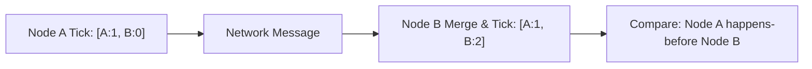

# Vector Clock Causal Order Tracker Skill

High-efficiency, zero-dependency Python implementation of **Vector Clocks and Distributed Causality Tracking**.

## Features
- **Exact Happens-Before Causality**: Distinguishes true causal precedence from independent concurrent actions.
- **Message Merging**: Monotonically combines vector timestamps across network boundaries.
- **Zero External Dependencies**: Pure Python standard library.
- **Native MCP Protocol**: JSON-RPC 2.0 stdio server compatible with Claude Desktop, Cursor, and Windsurf.

## Architecture

